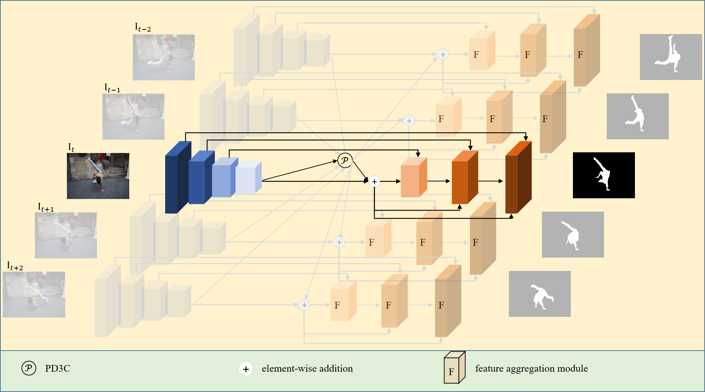
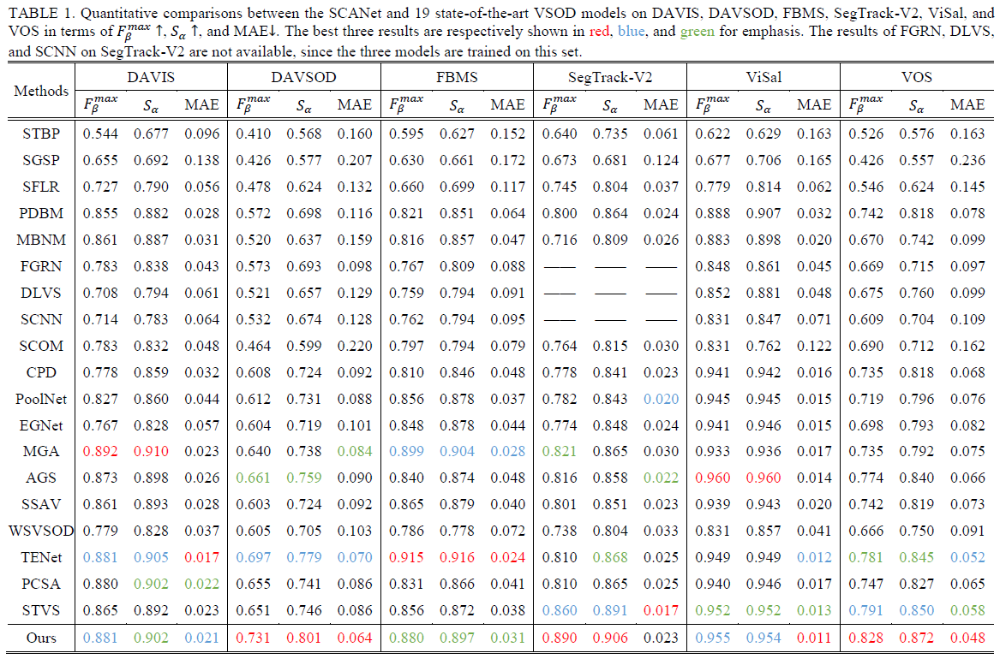
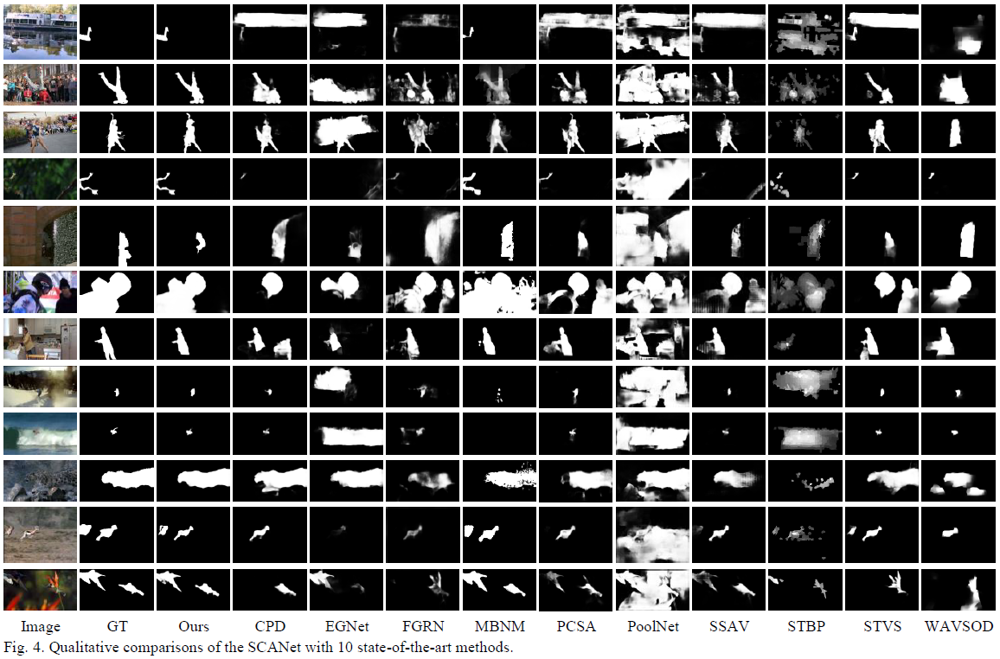

# SCANet
# [Spatiotemporal Context-aware Network for Video Salient Object Detection](https://link.springer.com/article/10.1007%2Fs00521-021-06845-3)

This repo. is an official implementation of the *SCANet* , which has been accepted in the journal *Neural computing and applications, 2022*. 

An typical example


The main pipeline is shown as the following, 


And qualitative and quantitative results are listed 



## Training
pretrained ViT is available at ([Baidu](https://pan.baidu.com/s/1dKUGKgRjRFf1AWcm4KMmHA)) [code:nnty]
```
python train.py
```

## Test
```
 python test.py
```
We provide the trained model file ([Baidu](https://pan.baidu.com/s/1lYyniflBGXJ5eVl94hBXow)) [code:u4yy]

The saliency maps are also available ([Baidu](https://pan.baidu.com/s/1OF4vwLEveopwtLr1_fP2Zw)). [code:e0pi]

## Citation
Please cite the `SCANet` in your publications if it helps your research:
```
@article{CHEN2022,
  title = {Spatiotemporal Context-aware Network for Video Salient Object Detection},
  author = {Tianyou Chen and Jin Xiao and Xiaoguang Hu and Guofeng Zhang and Shaojie Wang},
  journal = {Neural Computing and Applications},
  year = {2022},
}
```
## Reference
[STVS](https://github.com/guotaowang/STVS)
[BBSNet](https://github.com/zyjwuyan/BBS-Net)
